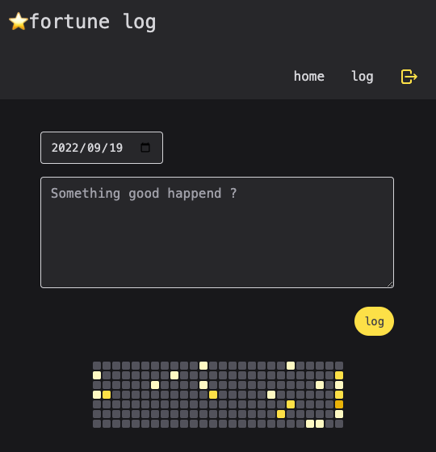
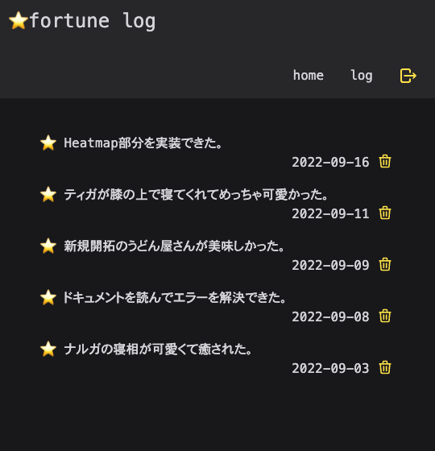

# 概要

- 日々のちょっとした「いいこと」を記録できるアプリです
- 記録した「いいこと」の数を Heatmap で可視化します

# 使い方

- ダミーのアドレス（例：kino@test.com)と 6 桁以上のパスワードで登録できます
- 日付ごとに「いいこと」を記録できます
- log ページから、記録した「いいこと」の確認と削除ができます

# 使用技術

## フロントエンド

- React
- Next.js
- TypeScript
- TailwindCSS
- ReactQuery
- Zustand

## バックエンド

- supabase
